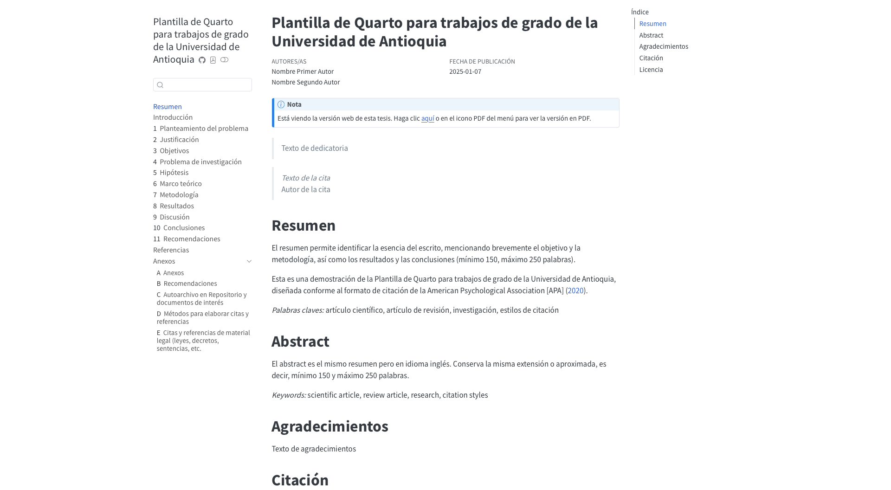
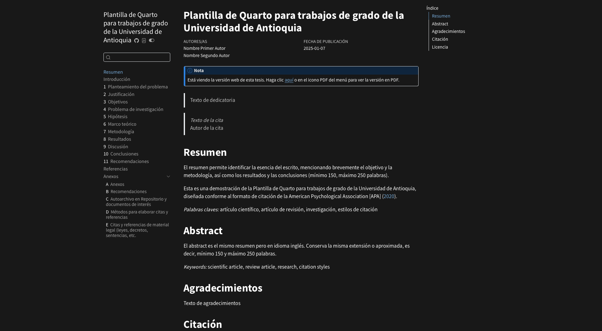
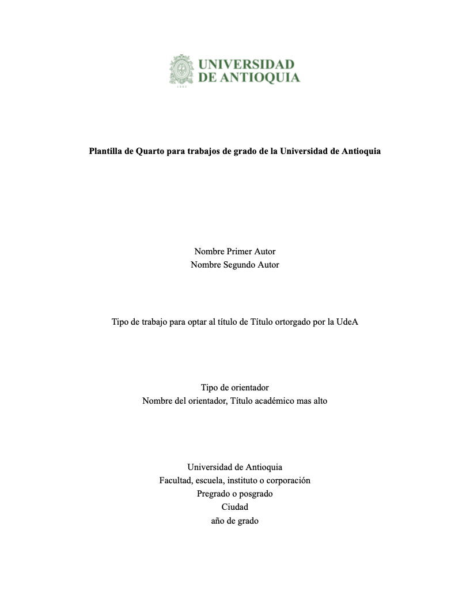
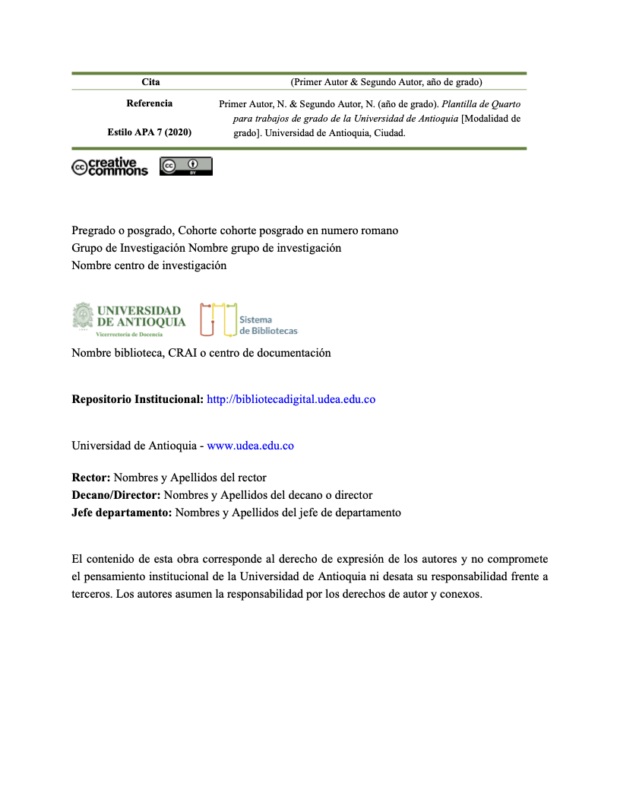

# Plantilla de Quarto para trabajos de grado de la Universidad de Antioquia

<p align="center">
  
  
</p>

<p align="center">
  
  
</p>

## Introducción

`udea-thesis` es una plantilla/extensión de [Quarto](https://quarto.org/) diseñada para la creación de trabajos de grado conforme a las directrices de la [Universidad de Antioquia (UdeA)](https://www.udea.edu.co), establecidas en la [Resolución Rectoral 47233](https://bibliotecadigital.udea.edu.co/handle/10495/19133) (21 de agosto de 2020). Aunque esta resolución no impone un formato único y deja la decisión a las dependencias o asesores, el Sistema de Bibliotecas proporciona plantillas en MS Word ([APA](https://bibliotecadigital.udea.edu.co/handle/10495/18841), [Chicago](https://bibliotecadigital.udea.edu.co/handle/10495/19341), [IEEE](https://bibliotecadigital.udea.edu.co/handle/10495/18844), [Vancouver](https://bibliotecadigital.udea.edu.co/handle/10495/18843)) y LaTeX ([APA](https://bibliotecadigital.udea.edu.co/handle/10495/25851), [IEEE](https://bibliotecadigital.udea.edu.co/handle/10495/26245)).

Esta plantilla fue desarrollada para la creación de trabajos de grado íntegramente en Quarto, promoviendo la adopción de este sistema de escritura académica de código abierto. Aunque toma como base los formatos APA, incluye adaptaciones específicas para generar tanto versiones en PDF como en HTML, aprovechando las ventajas de los libros de Quarto.  

>:warning: Se ofrece una versión en MS Word únicamente para revisión por parte de asesores o evaluadores, ya que no cumple con todas las características de la plantilla y no está lista para su entrega.

>:warning: Esta extensión se ofrece de manera independiente, sin depender de Python, R u otros lenguajes de programación, con el objetivo de minimizar problemas durante el proceso de renderización. Sin embargo, es importante destacar que una de las grandes ventajas de Quarto radica en su capacidad para integrar texto y código en un único entorno.

Puede ver un ejemplo en [PDF](https://alexespinosaco.github.io/udea-quarto-thesis/manuscrito.pdf) o visitando el [sitio web del repositorio](https://alexespinosaco.github.io/udea-quarto-thesis/). 

Para una demostración práctica de esta plantilla/extensión de Quarto en uso, puede consultar el repositorio de ejemplos (Muy pronto).

## Estructura

Debido a ciertas limitaciones y a decisiones de diseño, las versiones en PDF y HTML de la plantilla difieren en algunos aspectos, principalmente en términos estéticos y en el orden de algunos elementos. Sin embargo, es importante destacar que la versión en PDF es la que debe entregarse oficialmente al Sistema de Bibliotecas.

### Estructura de la versión en PDF

- Portada
- Citación, Licencia e información Institucional
- Cita (Opcional)
- Dedicatoria (Opcional)
- Agradecimientos (Opcional)
- Índice
- Lista de tablas
- Lista de figuras
- Resumen
- Abstract
- Cuerpo del trabajo de grado
- Referencias
- Anexos (Opcional)

### Estructura de la versión en HTML

- Portada
- Cita (Opcional)
- Dedicatoria (Opcional)
- Resumen
- Abstract
- Agradecimientos (Opcional)
- Citación, Licencia e información Institucional
- Cuerpo del trabajo de grado
- Referencias
- Anexos (Opcional)

### Estructura del repositorio / trabajo de grado

El repositorio está organizado para reflejar la estructura del documento de tesis. Los archivos `index.qmd` y `_quarto.yml` pueden editarse según sea necesario, pero no pueden borrarse ni renombrarse. El siguiente diagrama proporciona una visión general de la estructura de la plantilla. Revise el código en el repositorio para una mejor comprensión de cómo Quarto une todo.

```markdown
├── book/                      # Carpeta generada automáticamente por Quarto al renderizar (output).
│   ├── index.html             # Índice de la versión HTML, se omiten otros archivos.
│   └── manuscrito.pdf         # Versión en PDF del trabajo de grado.
├── _extensions/               # Extensiones utilizadas en el proyecto.
│   ├── udea-thesis/
├── anexos/                    # Capítulos correspondientes a los anexos.
│   ├── assets/                # Recursos relacionados con los anexos.
|   ├── a00_anexos.qmd
|   ├── a01_recomendaciones.qmd
|   ├── a02_autorarchivo.qmd
|   ├── a03_citas-referencias.qmd
|   └── a04_citas-referencias-legales.qmd
├── capitulos/                 # Capítulos principales del documento.
│   ├── assets/                # Recursos relacionados con los capítulos.
|   ├── 00_introduccion.qmd
|   ├── 01_planteamiento-problema.qmd
|   ├── 02_justificacion.qmd
|   ├── 03_objetivos.qmd
|   ├── 04_problema-investigacion.qmd
|   ├── 05_hipotesis.qmd
|   ├── 06_marco-teorico.qmd
|   ├── 07_metodologia.qmd
|   ├── 08_resultados.qmd
|   ├── 09_discusion.qmd
|   ├── 10_conclusiones.qmd
|   ├── 11_recomendaciones.qmd
|   └── 12_referencias.qmd
├── assets/                    # Recursos generales del proyecto.
├── guia-estilo/               # Archivos relacionados con las guías de estilo.
├── images/                    # Imágenes generales del proyecto (si no están en "assets").
├── qmd/                       # Archivos Quarto para las secciones introductorias o adicionales.
|   ├── _index-docx.qmd        # Índice o portada para la versión en Word.
|   ├── _index-html.qmd        # Índice o portada para la versión en HTML.
|   ├── agradecimientos.qmd    # Sección de agradecimientos.
|   ├── citacion.qmd           # Sección sobre cómo citar el documento.
|   └── licencia.qmd           # Información sobre la licencia del documento.
├── tex/                       # Archivos relacionados con LaTeX o configuraciones específicas.
├── .gitignore                 # Archivos y carpetas que Git debe ignorar.
├── LICENSE                    # Licencia bajo la cual se publica el repositorio.
├── _quarto.yml                # Archivo de configuración principal de Quarto.
├── apa.csl                    # Estilo de citación (APA en este caso).
├── index.qmd                  # Índice principal del documento.
├── README.md                  # Información general sobre el proyecto y cómo usarlo.
├── references.bib             # Archivo de referencias bibliográficas en formato BibTeX.
└── udea-quarto-thesis.Rproj   # Archivo del proyecto de RStudio.

```

## Instalación

Esta plantilla/extensión fue creada y probada utilizando las siguientes herramientas y versiones:

- [Quarto 1.6.39](https://quarto.org/docs/download/)
- [tinytex v2025.01](https://quarto.org/docs/output-formats/pdf-engine.html#installing-tex)

### En un proyecto nuevo

Ejecute en la Terminal:

```bash
quarto use template alexespinosaco/udea-quarto-thesis
```

Esto instalará la extensión y creará los archivos mencionados anteriormente.

### En un proyecto existente

Desde el directorio del proyecto o documento Quarto, ejecute en la Terminal:

```bash
quarto add alexespinosaco/udea-quarto-thesis
```

Este formato puede ser utilizado con un proyecto o documento Quarto existente. Esto instalará sólo los archivos en la carpeta `_extension` y no instalará los archivos por encima de eso (los archivos de demostración). Esta es también la forma de actualizar la extensión si ha habido cambios.

Ahora puede usar `udea-thesis` como formato o como un tipo de proyecto:

```yml
---
format:
  udea-thesis-html: default
  udea-thesis-pdf: default
  # udea-thesis-docx: default
---
````

```yml
---
project:
  type: udea-thesis
---
````

### Descargar los archivos / clonar el repositorio

-   Ir a <https://github.com/alexespinosaco/udea-quarto-thesis/>

-   Hacer clic en **\<\> Code** y copiar la URL bajo la pestaña HTTPS <https://github.com/alexespinosaco/udea-quarto-thesis.git>

> En este punto, podría descargar los archivos. Hacer clic en la opción **Download zip**. Esto descargará el archivo `quarto-workshop-main.zip`, el cual tendrá que descomprimir. 
>
> También podría ejecutar en la Terminal:
> ```bash
> git clone https://github.com/alexespinosaco/udea-quarto-thesis.git
> ```

-   En RStudio, ir a **File** \> **New Project** \> **Version Control** \> **From Git** > pegar la URL en el cuadro de **Repository URL**. Hacer clic en **Create Project**. Esperar a que termine

](https://rstudio-conf-2022.github.io/get-started-quarto/materials/images/clone-repo.gif)

## Uso

Para renderizar su trabajo de grado, ejecute en la Terminal:

```bash
quarto render
```

Por defecto, esto renderizará la tesis en formatos HTML y PDF. Puede controlar en qué formato se renderizará el trabajo de grado:

```bash
quarto render --to udea-thesis-pdf
```

Si no deseas renderizar el trabajo de grado en alguno de los formatos, puedes cambiar el comportamiento predeterminado en el archivo `_quarto.yml`, cambiando:

```yml
---
format:
  udea-thesis-html: default
  udea-thesis-pdf: default
  # udea-thesis-docx: default
---
````

a

```yml
---
format:
  # udea-thesis-html: default
  udea-thesis-pdf: default
  # udea-thesis-docx: default
---
````

Esto renderizará sólo la versión en PDF.

## Opciones de formato

El archivo `_quarto.yml` es un archivo YAML que contiene la configuración global del trabajo de grado. La mayoría de estos ajustes pueden modificarse siguiendo las [opciones de Quarto](https://quarto.org/docs/reference/projects/books.html). Algunos de estos ajustes están predeterminados en el archivo `_extension.yml`. Si tiene experiencia con Quarto, puede cambiarlos según sus necesidades.

>:warning: Prontamente se espera incluir un listado de los valores válidos para estos ajustes, dado que muchos hacen referencia a nombres específicos designados por la Universidad de Antioquia y, por tanto, no pueden ser cambiados arbitrariamente. Mientras tanto, estos valores pueden ser consultados en los desplegables disponibles al abrir en MS Word la [versión de MS Word de la plantilla](https://bibliotecadigital.udea.edu.co/handle/10495/18841) proporcionada por el Sistema de Bibliotecas.

Los ajustes específicos de esta plantilla que pueden modificarse en `_quarto.yml` son:

`tipo-documento`: "Tipo de trabajo"\
`titulo-otorgado`: "Título ortorgado por la UdeA"\
`tipo-orientador`: "Tipo de orientador"\
`nombre-orientador`: "Nombre del orientador"\
`titulo-orientador`: "Título académico mas alto"\
`unidad-academica`: "Facultad, escuela, instituto o corporación"\
`programa`: "Pregrado o posgrado"\
`ciudad`: "Ciudad"\
`ano-grado`: "año de grado"

`citacion`: "Primer Autor & Segundo Autor" # No incluir el año\
`referencia`: "Primer Autor, N. & Segundo Autor, N." # Sólo incluir los nombres\
`modalidad-grado`: "Modalidad de grado"

`licencia-tipo`: assets/license/by.png

`cohorte-posgrado`: "cohorte posgrado en numero romano"\
`grupo-investigacion`: "Nombre grupo de investigación"\
`centro-investigacion`: "Nombre centro de investigación"

`biblioteca`: "Nombre biblioteca, CRAI o centro de documentación"

`rector`: "Nombres y Apellidos del rector"\
`decano-director`: "Nombres y Apellidos del decano o director"\
`jefe-departamento`: "Nombres y Apellidos del jefe de departamento"

`cita`:\
  `texto`: "Texto de la cita"\
  `autor`: "Autor de la cita"

`dedicatoria`: "texto de dedicatoria"\
`agradecimientos`: "Texto de agradecimientos"

`abreviaturas`: "abreviaturas.tex"

`format`:\
  `udea-thesis-html`: default\
  `udea-thesis-pdf`: default\
  `udea-thesis-docx`: default

>:bulb: De ser necesario, la plantilla permite incluir un archivo `.tex` con las abreviaturas. El cual se renderizará sólo en el PDF.

## Agradecimientos

Esta plantilla/extensión fue creada como un ejercicio académico en los ratos libres y no cuenta con un apoyo económico detrás. Por ello, consideramos importante agradecer y reconocer a quienes, con su trabajo, han servido de guía o inspiración para realizar este proyecto. Agradecemos a [todas las personas que hay detrás de Quarto](https://quarto.org/docs/blog/posts/2024-11-25-1.6-release/#acknowledgments) y su excelente guía. También extendemos nuestro reconocimiento a los creadores de otras plantillas por compartir abiertamente su código, especialmente: [Bjørn Peare Bartholdy](https://github.com/bbartholdy/endgame), [Daniel Vartanian](https://github.com/danielvartan/abnt), [Eli Holmes](https://github.com/nmfs-opensci/quarto-thesis), [Fred Guth](https://github.com/fredguth/tufte-quarto/), [Gonzalo García-Castro](https://github.com/gongcastro/upfthesis/), [James H.](https://github.com/james-d-h/quarto-phd-thesis/), [Julian Tao](https://github.com/juliantao/quarto-asu-thesis/), [Rob J Hyndman](https://github.com/quarto-monash/thesis), [Samir](https://codeberg.org/Sam.ir/quarto-template-article). Asimismo, agradecemos a los autores de diversos artículos y publicaciones en blogs que han sido de gran utilidad: [Cameron Patrick](https://cameronpatrick.com/post/2023/07/quarto-thesis-formatting/), [Christopher T. Kenny](https://christophertkenny.com/posts/2023-07-01-creating-quarto-journal-articles/), [Gonzalo García-Castro](https://gongcastro.github.io/blog/upfthesis/upfthesis.html), [Rich Posert](https://blog.posertinlab.com/posts/2023-06-09-writing-a-dissertation-in-quarto/).

## Citación

Si decide utilizar el formato `udea-thesis` en su trabajo de grado, le solicitamos amablemente que considere la posibilidad de citarlo. La creación y el mantenimiento de este formato de Quarto, gratuito y de código abierto, ha requerido un esfuerzo considerable, por lo que le agradecemos que lo cite. A continuación encontrará los detalles de la cita.

[APA](https://apastyle.apa.org/):

```markdown
Espinosa-Correa, Á. (2025). Plantilla de Quarto para trabajos de grado de la Universidad de Antioquia. https://github.com/alexespinosaco/udea-quarto-thesis/
```

[BibTeX](https://www.bibtex.org/):

```markdown
@unpublished{espinosa-correa2025,
  author = {Álex Espinosa-Correa},
  title = {Plantilla de Quarto para trabajos de grado de la Universidad de Antioquia},
  url = {https://github.com/alexespinosaco/udea-quarto-thesis/},
  year = {2025}
}
```

## Contribuir

Si desea contribuir a la mejora y ampliación de esta plantilla/extensión, no dude en ponerse en contacto, o bien abra un issue o un pull request en este repositorio. Todas las contribuciones son bienvenidas y altamente valoradas. 

## Licencia

Esta plantilla/extensión está publicada bajo la [Licencia MIT](LICENSE).

## Disclaimer

Este repositorio es el resultado de un esfuerzo académico independiente y no representa una comunicación oficial de la Universidad de Antioquia ni de ninguno de los colaboradores mencionados.

## Más información

- [Introducción a Quarto](https://quarto.org/)
- [Guía de Quarto para Libros](https://quarto.org/docs/books/)
- [Guía de Quarto para formatos personalizados](https://quarto.org/docs/extensions/formats.html)
- [Guía de Quarto para tipos de proyectos](https://quarto.org/docs/extensions/project-types.html)
- [Otras plantillas](https://github.com/Jupyter4Science/awesome-quarto-thesis)
